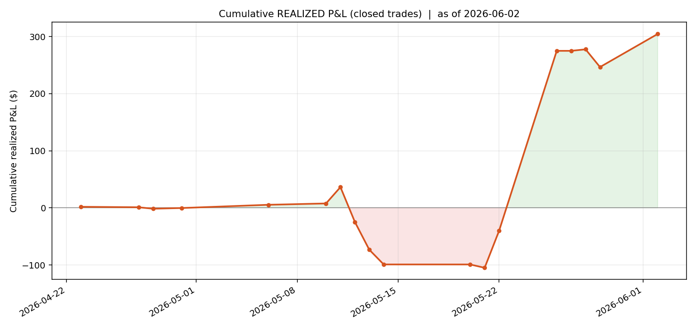
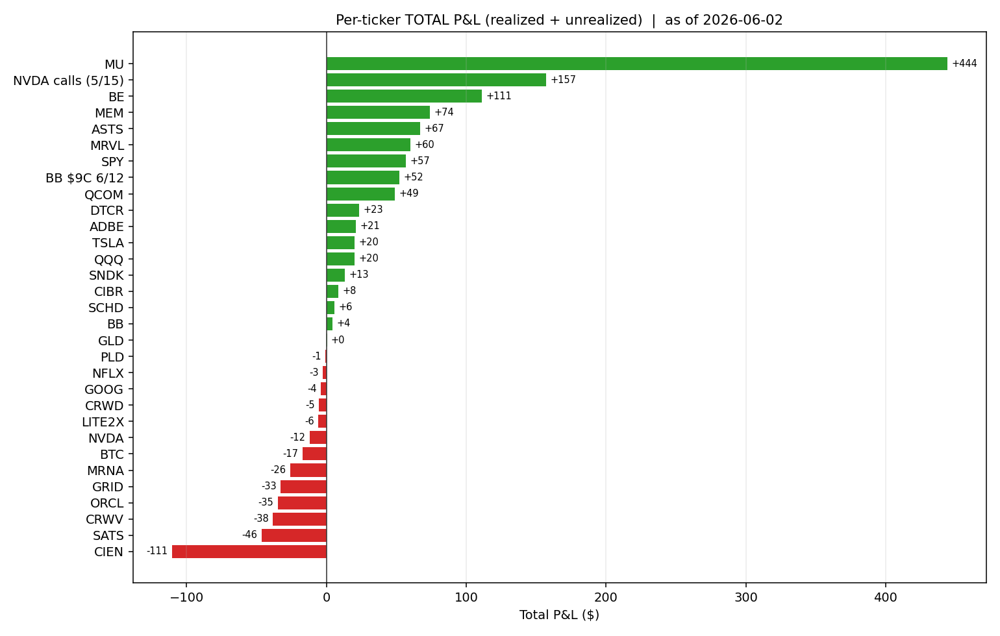

# 📊 Little Pig Stock — Dashboard

> 🔄 数据来源:`tools/portfolio_stats.py`(单一数据源)。
> ⚠️ NAV/现金为**台账轧差估算**,待 Robinhood 账户页核对;持仓价为 6/2 收盘附近(WebSearch)。

---

## 💰 账户快照（2026-06-02，估算）

| 指标 | 数值 |
|---|---|
| 总资产 NAV（估算） | **~$7,526** |
| 现金（估算） | ~$1,192 |
| 历史净入金 | $6,675.08 |
| **总盈亏（NAV − 入金）** | **+$851 / +12.7%** |
| ↳ 已实现（落袋） | +$514（股 +$305 + 期权 +$209） |
| ↳ 未实现（现价） | +$338 |
| 目标年化 | ~25% |

> 📈 6/1–6/2 大涨主要靠 **MU 飙到 $1,059**(2 股浮盈 +$187)和 **MRVL +29%**(黄仁勋称"下一个万亿公司")。

---

## 📈 累计已实现盈亏曲线

---

## 🎯 逐票总盈亏（已实现 + 未实现）

**🟢 前 5 名赢家**
| 票 | 总盈亏 | 说明 |
|---|---|---|
| MU | **+$444** | 257 已实现 + 187 浮盈;现 2 股 @$1,059,头号 |
| NVDA 期权 | **+$157** | 两笔 call 短炒(运气) |
| BE | **+$111** | 3 天干净短打 |
| MEM | **+$74** | 拿住 11 天 |
| ASTS | **+$67** | 老仓 +$82,新 5 股已转浮亏 -$15 |

**🔴 前 5 名输家**
| 票 | 总盈亏 | 说明 |
|---|---|---|
| CIEN | **−$111** | 最大亏损源,反复来回搓,6/2 已清仓 |
| SATS | −$47 | 1 天就割 |
| CRWV | −$38 | 计划外 |
| ORCL | −$35 | 违反计划全清 |
| GRID | −$33 | 主题重叠 churn |

---

## 📦 当前持仓（2026-06-02）

| 票 | 数量 | 均价 | 现价 | 市值 | 未实现 | 占NAV | 主题 |
|---|---|---|---|---|---|---|---|
| **MU** | 2 | $965.89 | $1,059.44 | $2,119 | +$187 | **28.2%** 🔴 | AI 硬件/存储 |
| SPY | 1.375 | $718.57 | $760.00 | $1,045 | +$57 | 13.9% | 核心 |
| **MRVL** | 3 | $262.97 | $282.92 | $849 | +$60 | 11.3% | AI 半导体（新） |
| **ADBE** | 3 | $267.00 | $274.03 | $822 | +$21 | 10.9% | 软件设计（新,非AI）|
| ASTS | 5 | $107.89 | $104.90 | $524 | −$15 | 7.0% | 太空 |
| DTCR | 16.74 | $29.07 | $30.47 | $510 | +$23 | 6.8% | AI 数据中心 |
| BB | 30 | $8.63 | $8.78 | $263 | +$4 | 3.5% | 投机 |
| 期权 | DJT 6/18 + NOK 6/18 + BB 11C 6/26 | | | ~$202 | — | 2.7% | 赌场 |

> 已清仓:CIEN(6/2 全出,财报前)、QCOM(6/2 全出 +$49);BB $9C 平仓 +$114(净 +$52)。

---

## 🪣 四桶配置（当前 vs 目标）

| 桶 | 目标 | 当前(约) | 状态 |
|---|---|---|---|
| 💵 现金储备 | $1,250 (17%) | ~$1,192 | 🟡 逼近 $1,000 地板 |
| ⚓ 核心 SPY/QQQ | $1,250 (17%) | ~$1,045 | 🟡 略低 |
| 🛰️ 卫星 | $4,160 (57%) | **~$4,824 (64%)** | 🔴 超配 + **5 只**(超 4 槽上限) |
| 🎰 赌场 | $650 (9%) | ~$465 | 🟢 在额度内 |

---

## 📊 交易统计

| 指标 | 数值 |
|---|---|
| 交易过的标的数 | 30 |
| 已平仓票胜率 | **11 赢 / 13 亏 = 46%** |
| 最大单票赢家 | MU +$444（含浮盈） |
| 最大单票输家 | CIEN −$111（已清仓） |
| 主要毛病 | 高频翻仓 / 板块集中 / 追涨 |

---

## 🚦 纪律红线状态（策略 v1.0）

| 红线 | 状态 |
|---|---|
| 现金 ≥ $1,000 | 🟡 ~$1,192(逼近) |
| 赌场 ≤ $800 | ✅ ~$465 |
| **卫星单只 ≤ 20% NAV** | 🔴 **MU 28.2%,超线** |
| **卫星 ≤ 4 只 + 同主题≤2 + 1 非AI** | 🔴 **5 只;MU+MRVL+DTCR 三只 AI 半导体/基建** |
| 每只必挂止损 | ⏳ 待确认 |
| 博主/新闻 24h 冷静 | 🔴 MRVL 当天追涨(黄仁勋表态)|
| day-trade 每周 ≤ 1 | 🔴 6/1–6/2 又一轮高频 |

---

## 🗓️ 待办 / 下一步

- [ ] **MU 减回 ≤20% NAV**(现 28%;减约 $600 / 0.5 股)
- [ ] **卫星砍到 4 只**(MU/MRVL/DTCR 三 AI 半导体留 2,DTCR 或 MRVL 取舍)
- [ ] ADBE 注意:CEO 刚辞任 + 6/11 财报,设好止损
- [ ] 给每只卫星补挂止损
- [ ] **提供 Robinhood 账户页(NAV+现金)** 让我核准估算值
- [ ] 补全画像待办(年龄/身份、IBKR、常看博主)

---

📁 详见 `journal/reviews/`（复盘）· `strategy/strategy_v1.0_simple.md`（策略）· `profile/client_profile_v2.md`（画像）。本页由 `tools/portfolio_stats.py` 驱动。
